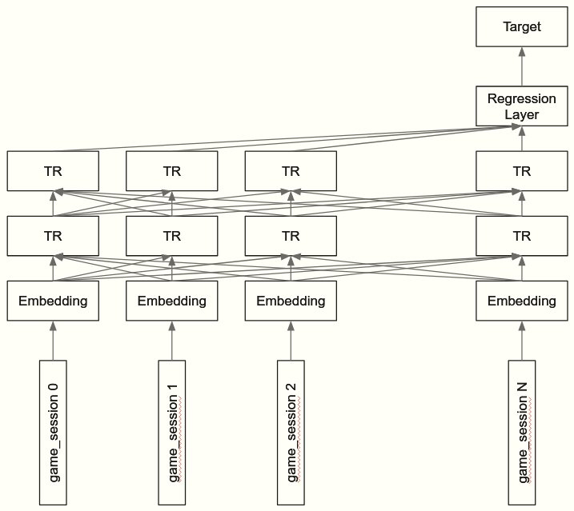

# 2019 Data Science Bowl   


## Introduction   
- 2019 DataScienceBowl introduction [[kaggle]](https://www.kaggle.com/robikscube/2019-data-science-bowl-an-introduction)  

本届的2019DSB是美国教育部的一个孩童教育APP，比赛者通过给定的数据，设计算法，预测小孩子在软件中的得分。  


- Target   
    - 3表示第一次尝试就能解决任务   
    - 2表示第2次尝试就能解决任务   
    - 1表示3次以上才能解决任务   
    - 0 表示永远无法解决任务   

- Train    
```python
train.shape
(11341042, 11)
keep_id = train[train.type == "Assessment"][['installation_id']].drop_duplicates()
train = pd.merge(train, keep_id, on="installation_id", how="inner")  
(8294138, 11)  
```  
    - event_id 活动的类型     
    - game_session  对每一个游戏或视频回话的唯一标识 
    - timestamp 客户端生成的时间     
    - event_data JSON数据，event_count, event_code, and game_time; otherwise    
    - installation_id 应用app的安装id，可作为用户唯一标识     
    - event_count 游戏中活动的计数器     
    - event_code 表示游戏中不同活动的代码：2000通常表示游戏开始 
    - game_time  每一个game_session的持续时间    
    - title  游戏或者视频的名字
    - type 包括 Game', 'Assessment', 'Activity', 'Clip'   
    - world   


- Test   
```python
test.shape  
(1156414, 11)   
test.installation_id.nunique()   
1000  
```


## Winner Solutions    


### 1st place solution - single lightgbm (average on multi-seeds 5 fold).  [[discussion]](https://www.kaggle.com/c/data-science-bowl-2019/discussion/127469)   

#### 1.1 Validation Strategy  
- GroupK CV
- Nested CV  


#### 1.2 Feature Engineering  
 

- [ ] 20,000 features   

#### 1.3 Feature Selection  
- [ ] What methods have been used?  

- [ ] Truncated adversarial validation ?  

- [ ] How to experiment to see whether or not a new feature is useful?   
    - [[link]](https://www.kaggle.com/c/home-credit-default-risk/discussion/64596#378926)  
    为了增加CV的自信度，一般可以进行如下操作：  
    - 保证大多数folds 是在提升的；   
    - 如果对与当前cv的提升不那么自信，可以替换成一个新的seed做一个double-check    

- [ ] null important method [[url]](https://www.kaggle.com/c/data-science-bowl-2019/discussion/*https://www.kaggle.com/ogrellier/feature-selection-with-null-importances*)


#### 1.4 Model   
- [ ] Data Augmentation   
- [ ] Loss ?     
    -  how to get adversarial AUC to 0.5？ 
- [ ] Threshold Optimizer Rounder   
- [ ] Ensemble    
- [ ] final features [[csv]](https://storage.googleapis.com/kaggle-forum-message-attachments/730397/14822/features_500_lgb.csv)   

### 2nd place solution [[discission]](https://www.kaggle.com/c/data-science-bowl-2019/discussion/127388)   


### 3rd solution - single TRANSFORMER model, link to kernel [[discussion]](https://www.kaggle.com/c/data-science-bowl-2019/discussion/127891) [[kernel]](https://www.kaggle.com/limerobot/dsb2019-v77-tr-dt-aug0-5-3tta?scriptVersionId=27448615)        


The performance of the BERT, ALBERT and GPT2 models was not good. (Because these models use position embedding) 
- [ ] why?  

So I used the TRANSFORMER model without position embedding.   
- [ ] What is without positional embedding?  


#### 3.1 Prepare   
- [ ] What preprocess includes?  

- [ ] What is pd.crosstab()  


#### 3.2 Model   
   
- [ ] The key here is how to create embedding from the game_session.
- [ ] categorical vector?  
hyper parameters
- optimizer: AdamW
- schedular: WarmupLinearSchedule
- learning_rate: 1e-04
- dropout: 0.2
- number of layers : 2
- embedding_size: 100
- hidden_size: 500   


#### 3.3 Modified loss function  

mse loss (binary classification)   


#### 3.4 Data Augmentation   
- [ ] How many methods of data augmentation have been used?  


### 8th place solution [[discussion]](https://www.kaggle.com/c/data-science-bowl-2019/discussion/127285) [[kernel]](https://www.kaggle.com/zgzjnbzl/dsb-mlp-216-feature)       


### 14th place solution [[discussion]](https://www.kaggle.com/c/data-science-bowl-2019/discussion/127221) [[kernel]](https://www.kaggle.com/khahuras/bowl-2201-a?scriptVersionId=27403894)   


### My own Solutions    


  


## Reference   

-  2019 DSB Medal Solutions etc. [[url]](https://www.kaggle.com/c/data-science-bowl-2019/discussion/129119)   


